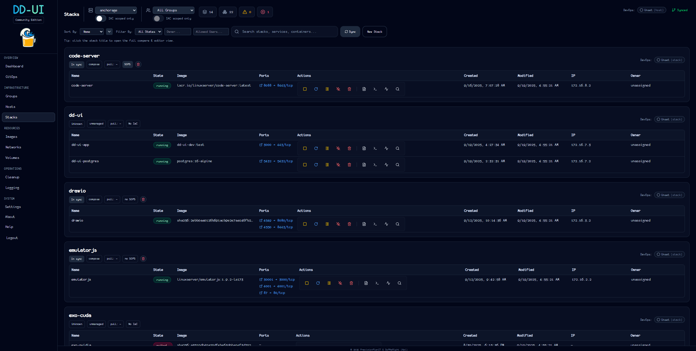

#  DD-UI (Designated Driver UI)
> DD-UI is a declarative, security-first Docker orchestration engine. It compares runtime state (running containers) to declared state (your IaC repo), shows drift, and puts encryption (SOPS/AGE) and DevOps ergonomics first. **Please Docker responsibly.**

<!-- sf:project:start -->
    
<!-- sf:project:end -->
<!-- sf:badges:start -->
     
<!-- sf:badges:end -->
<!-- sf:image:start -->
 
<!-- sf:image:end -->

## What is DD-UI?

DD-UI is a **Docker management engine that puts DevOps and encryption first** — in essence, a Docker-focused CI/CD pipeline with a UI.

- **Infrastructure as Code.** DD-UI manages hosts, groups, and Docker "stacks" as standardized, CI/CD-compatible IaC files. Deployment state is decoupled from the app — edit it in the editor of your choice, and DD-UI redeploys containers when the IaC changes.
- **Encryption, first-class.** Encrypt/decrypt any IaC file — compose and `.env` included — with SOPS/AGE, right from the UI. Values are censored by default, so you can stream or push configs to a repo safely, and DD-UI can still deploy them encrypted.
- **A rich experience.** Many of the features you'd expect from a Docker GUI, plus industry tools like xterm 🔥 and monaco (the editor from VS Code 🎉).
- **Free and open source** under the **AGPL-3.0-or-later** — free forever for personal, homelab, non-profit, and commercial use alike (a commercial license is available if you need proprietary terms).

> 📸 **[See DD-UI in action →](docs/Screenshots.md)** — SOPS-encrypted stacks decrypted on the fly, live logs, in-container terminal, drift detection, cleanup, and more.

## Status

> ⚠️ **Pre-release — ~85–95% functional.** Core works; some advanced features are partial (git-sync is currently unstable). **Before you rely on it, skim the [open issues](https://github.com/PrPlanIT/DD-UI/issues) and [Known Issues](docs/Roadmap.md) for any dealbreakers.** See **[Roadmap & Status](docs/Roadmap.md)** for scope & cadence. CHEERS!

---

## What DD-UI does today
- **Container control**: start / stop / pause / resume / kill containers.
- **Live logs**: dedicated logging view with advanced filters.
- **In-container terminal**: an xterm-powered shell for a rich experience.
- **Editor**: edit compose, `.env`, and scripts with monaco (the editor from VS Code) — no compromise vs other Docker tools.
- **Inventory**: list hosts.
- **Stacks / containers**: every running container across all your systems in one view.
- **Sync**: one click triggers an IaC scan (local repo) plus a runtime scan per host (Docker).
- **Compare**: runtime vs desired (images, services), with a per-stack drift indicator.
- **Usability**: per-host search, fixed table layout, ports rendered one mapping per line.
- **SOPS awareness**: detect encrypted files; never decrypt by default (explicit, audited reveal flow).
- **Auth**: OIDC is **mandatory** — there are no local accounts. Authenticate through your IdP (Zitadel/Keycloak/Authentik/Okta/Auth0) or you're not getting in. Session probe, login, logout (RP-logout optional).
- **API**: `/api/...` (JSON), with the static SPA served by the backend.
- **SOPS CLI integration**: the server runs `sops` for encrypt/decrypt; no plaintext secrets are stored.
- **Health pills**: health-aware state (running / healthy / exited …).
- **Stack Files page**: view/edit compose/env/scripts against runtime context, with gated SOPS decryption.
- **Docker Cleanup page**: prune or clear the build cache from the UI.

---

## 📚 Documentation

**[Full documentation →](docs/README.md)** — deploy, configure, and run DD-UI.

- **[Installation (Docker Compose)](docs/Installation.md)** — requirements, compose example, `.env`, Nginx
- **[Development](docs/Development.md)** — run the UI/API locally
- **[Environment Variables](docs/Environment_Variables.md)** — all environment variables
- **[SOPS / AGE](docs/SOPS.md)** — encryption keys, encrypt, decrypt
- **[Usage](docs/Usage.md)** — using DD-UI + IaC layout
- **[Architecture](docs/Architecture.md)** — high-level design
- **[Security](docs/Security.md)** — posture & disclosure
- **[Roadmap & Status](docs/Roadmap.md)** — scope, cadence, known issues

---

## Contributing
- File issues with steps, logs, and versions.
- Small, focused PRs are best (typos, error handling, UI polish).
- Sample IaC directories welcome!
- Security-related PRs and hardening suggestions are especially appreciated (SOPS/AGE, cookie settings, RBAC, etc.).

---

## Support / Sponsorship
If you’d like to help keep the project moving:

---

## License

DD-UI is distributed under the **[AGPL-3.0-or-later](LICENSE)** license — free and open for everyone, including commercial use, under its copyleft terms. See **[LICENSING.md](docs/LICENSING.md)** for commercial/proprietary licensing options.

> _This section is a human‑readable summary and not a substitute for the license. Nothing here grants rights by itself._

---

## Disclaimer
The Software provided hereunder (“Software”) is licensed “as‑is,” without warranties of any kind—express, implied, or telepathically transmitted. The Softwarer (yes, that’s totally a word now) makes no promises about functionality, performance, compatibility, security, or availability—and absolutely no warranty of any sort. The developer shall not be held responsible, even if the software is clearly the reason your dog decided to orchestrate its own sidecar, your mom scored five tickets to Hawaii but you missed out because you were knee‑deep in a `docker compose` rabbit hole, or your stack drifted so hard it achieved sentience and renamed itself.

If using this orchestration UI leads you down a rabbit hole of obsessive network optimizations, breaks your fragile grasp of version pinning, or causes an uprising among your offline‑first containers—sorry, still not liable. Also not liable if your repo syncs so fast it rips a hole in the space‑time continuum **or** if your `.env` files multiply like Tribbles. The developer likewise claims no credit for anything that actually goes right either. Any positive experiences are owed entirely to the unstoppable force that is the Open Source community.

It’s never been a better time to be a PC user—or a homelabber. Just don’t blame me when YAML inevitably eats your weekend.
