# DD-UI — Screenshots

A tour of DD-UI in action. ← back to the [README](../README.md).

## 🔐 Encryption on the fly (SOPS / AGE)
The headline feature: compose and `.env` values stay encrypted at rest and are revealed only on an explicit, audited request — DD-UI can still deploy them encrypted.

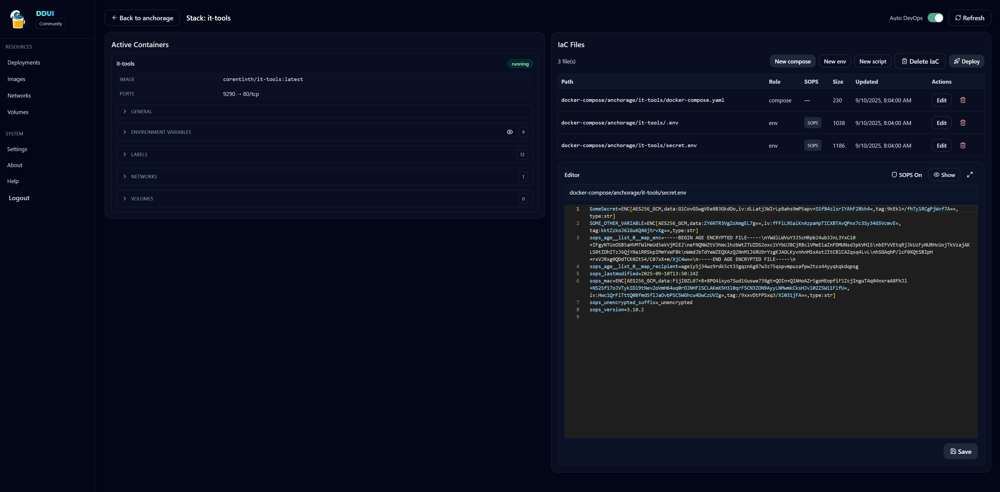

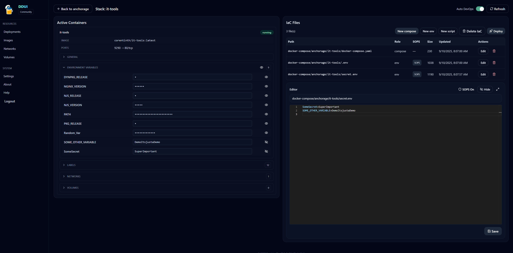

## 📚 Stacks & hosts
Every stack across every host in one view, with per-stack drift indicators.

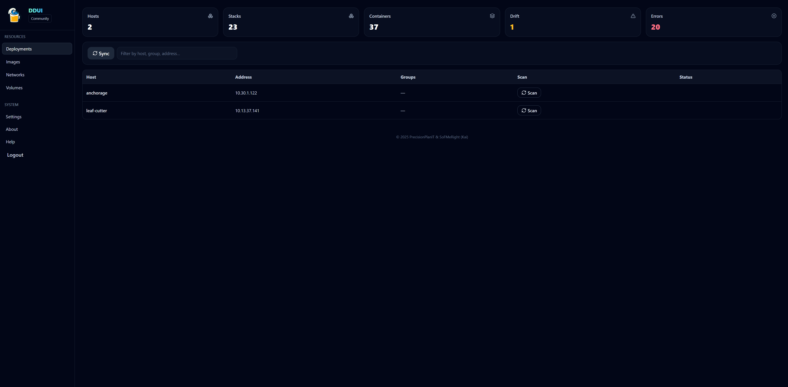

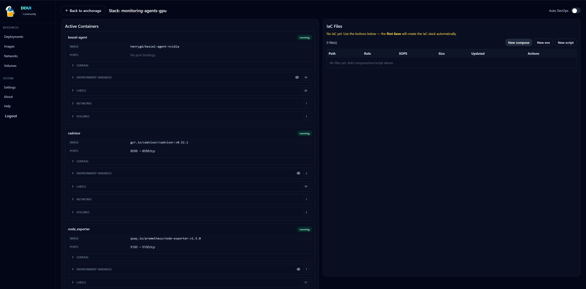

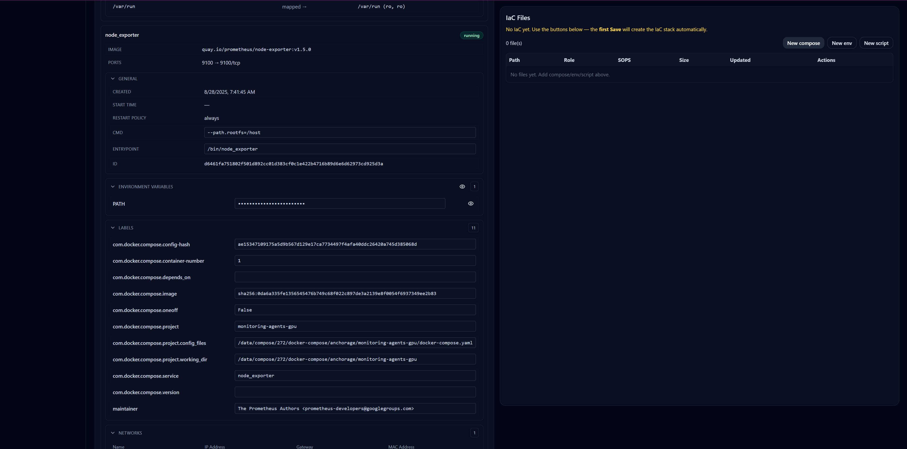

## ✏️ Editing
Monaco (the editor from VS Code) for compose, `.env`, and scripts.

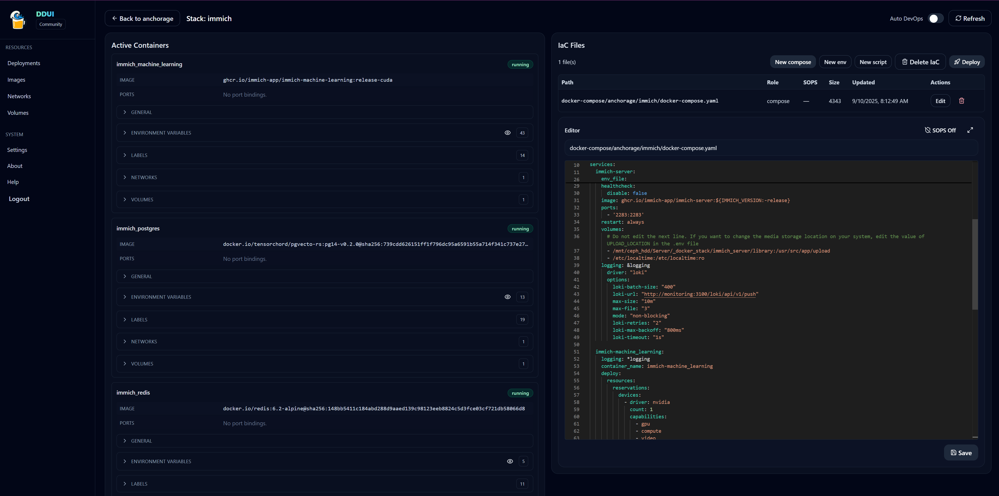

## 👁️ Observability
Live logs, a dedicated logging view, per-container stats, and an in-container terminal.

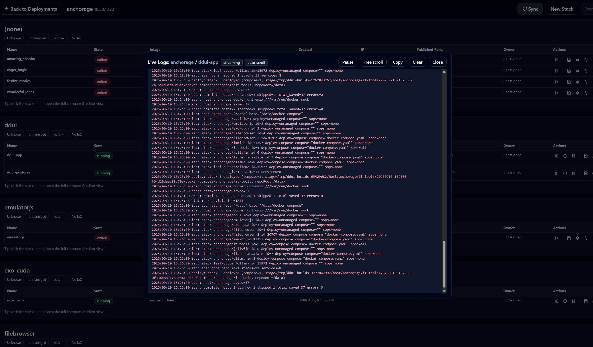

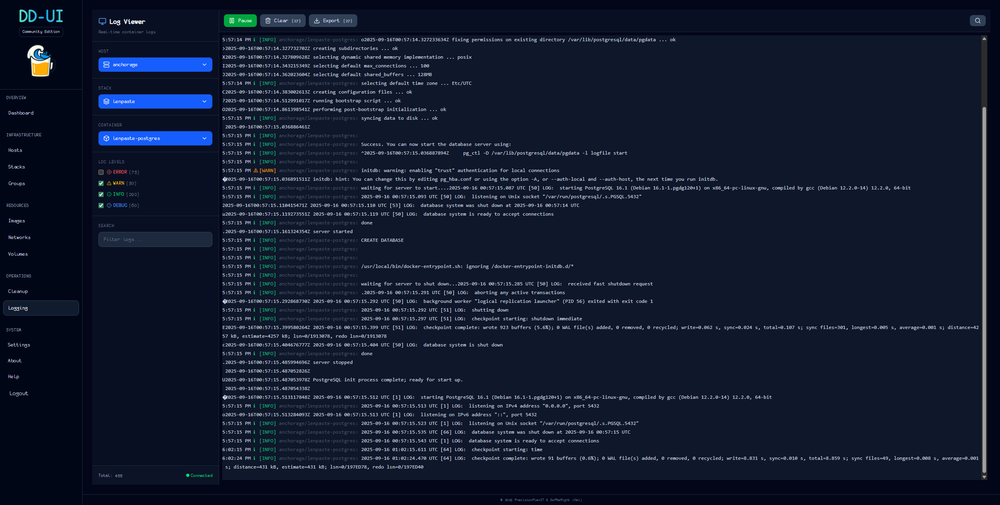

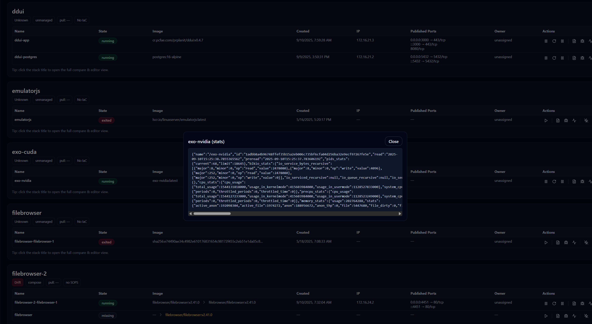

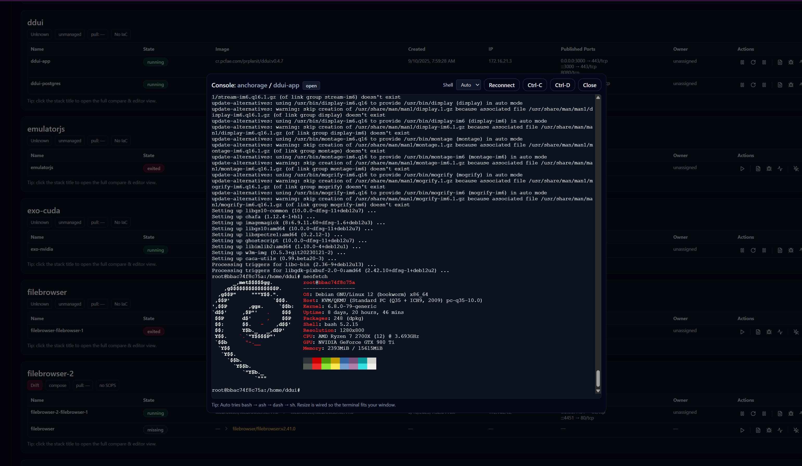

## 🧱 Docker resources
Images, networks, volumes, and a cleanup/prune page.

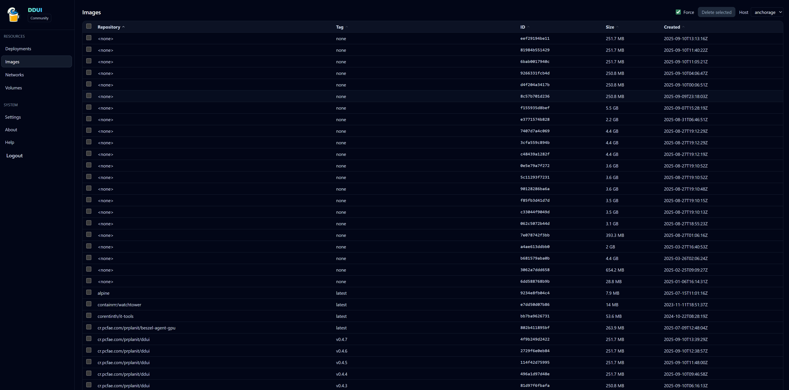

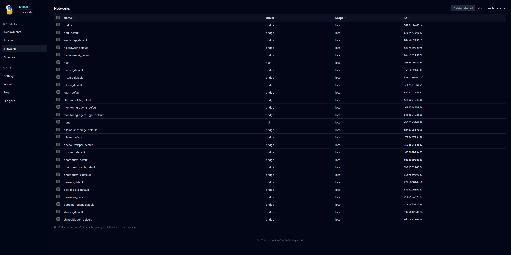

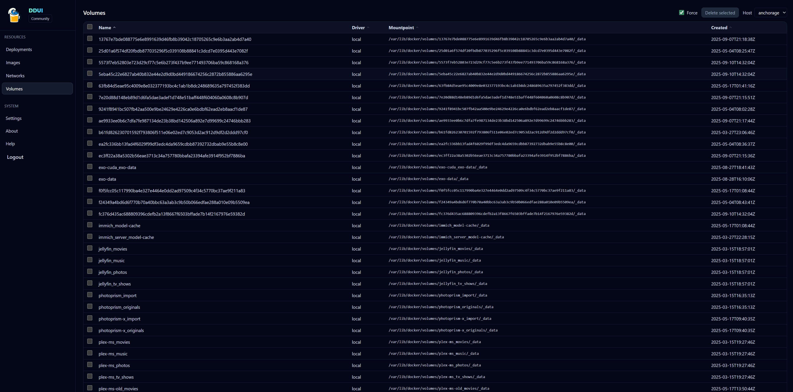

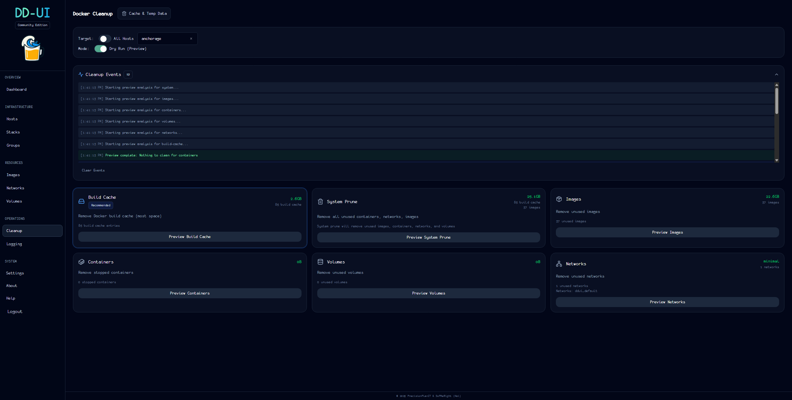
